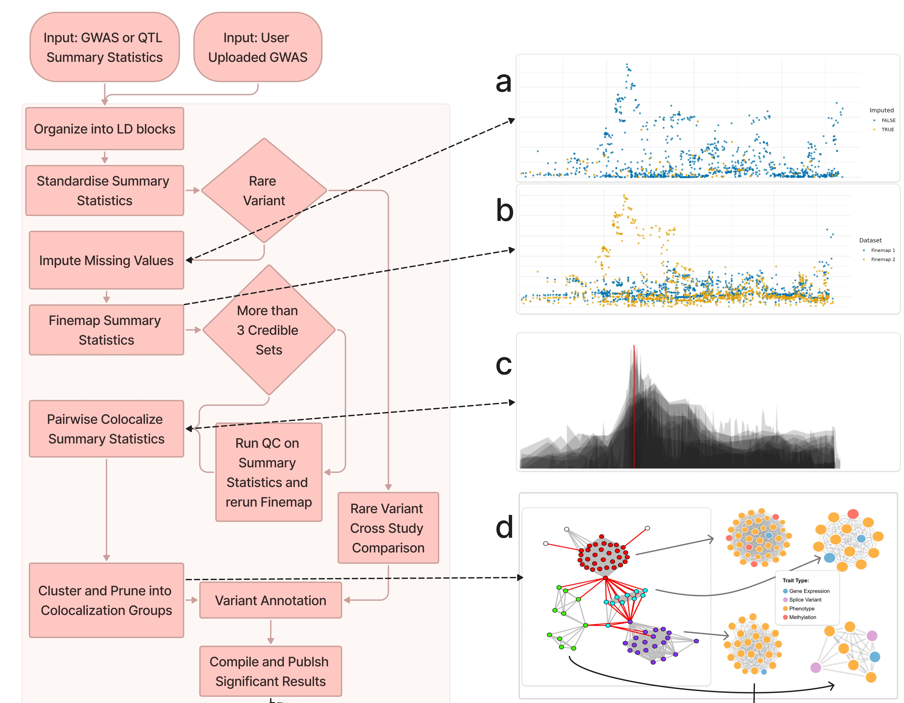

# genotype-phenotype-map

Pipeline for ingesting GWAS and QTL summary statistics, performing finemapping and colocalisation.




## Onboarding

The best way to understand how the GPMap pipeline works is by looking at the `Snakefile`.  This is a literal representation of the steps that are
performed in the pipeline, the order in which they run, and how they are called.

1. Clone the repository on ieu-p1 (or a machine with access to the data):
   ```bash
   git clone git@github.com:MRCIEU/genotype-phenotype-map.git && cd genotype-phenotype-map
   ```

2. Populate the `.env` file:
   - Use `.env.pipeline_local` or `.env.pipeline_worker` as a template if available
   - Set `DATA_DIR`, `RESULTS_DIR`, and other variables as needed

3. Add studies to `pipeline_steps/data/study_list.csv` (see [DOCUMENTATION.md](DOCUMENTATION.md#adding-new-data-to-the-pipeline))

4. Run the pipeline:
   ```bash
   ./run_pipeline.sh
   ```
   This first identifies studies that have not been processed, then runs the Snakemake pipeline.

**Note:** Snakemake performance degrades with very large batches. Keep the number of studies per run below ~200,000.

### Development

#### Tests

Tests require substantial test data and are not run in GitHub Actions. You must run tests locally before merging a PR:

```bash
make test
```

This takes around 15 minutes and validates the pipeline and pipeline worker.

#### Linting

To check and fix code style:

```bash
make format    # Format R files with styler
make lint      # Run lintr
make lint-summary  # Summarise lint issues
```

## Documentation

See [DOCUMENTATION.md](DOCUMENTATION.md) for:

- Adding new data to the pipeline
- Ancillary data requirements
- Data and results directory layout

## Wiki

See [the wiki](https://github.com/MRCIEU/genotype-phenotype-map/wiki) for:

- More detailed information on how to add data to the pipeline
- Formatting data into BESD format
- More detailed data architecture information
- More detailed information of the results